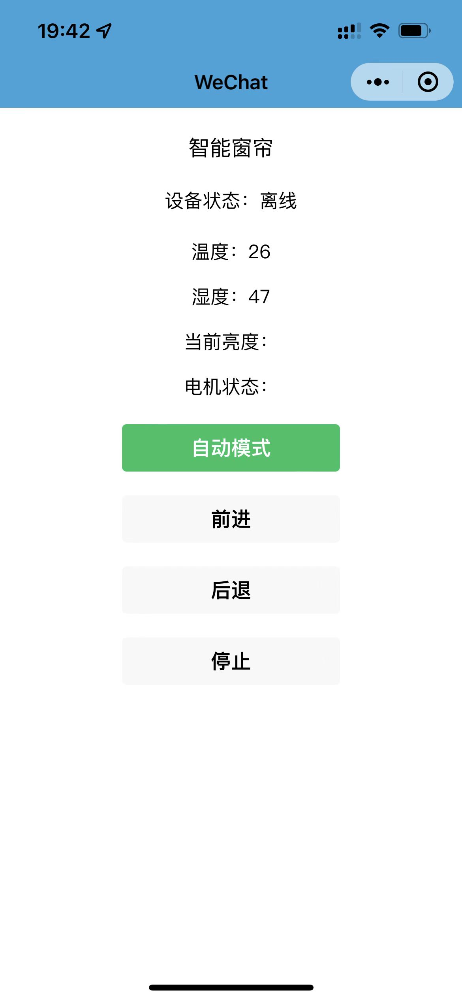
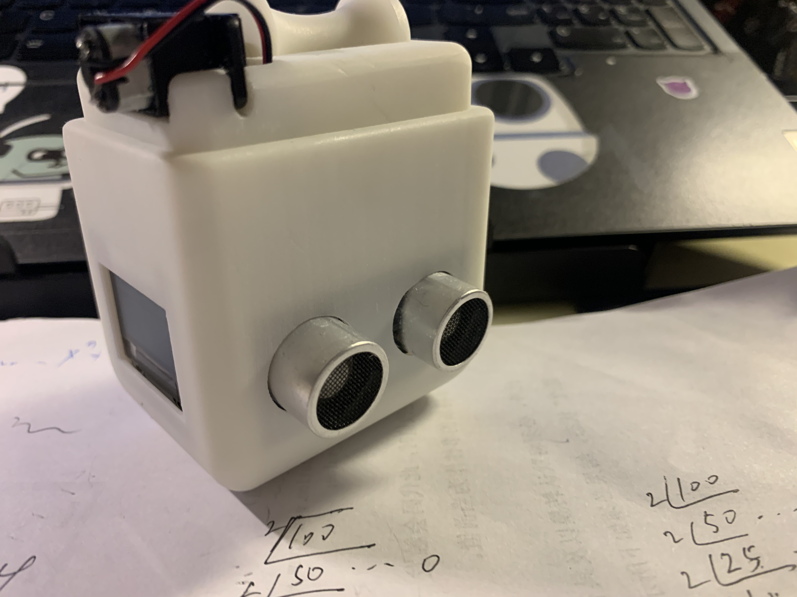

# Smart curtain
智能窗帘

##Smart curtain有哪些功能？
* 能够采集环境的状态如温度和光照强度
* 可以将状态信息实时显示到小程序和Oled屏幕中
* 有配套的微信小程序，可以设置手动模式和自动模式
*

## 问题反馈
个人项目 若有不足 欢迎指正
 

## 项目展示
* 
* 
* 
* 

## 关于作者
* warren@伟
* E-mail:warren_wzw@163.com